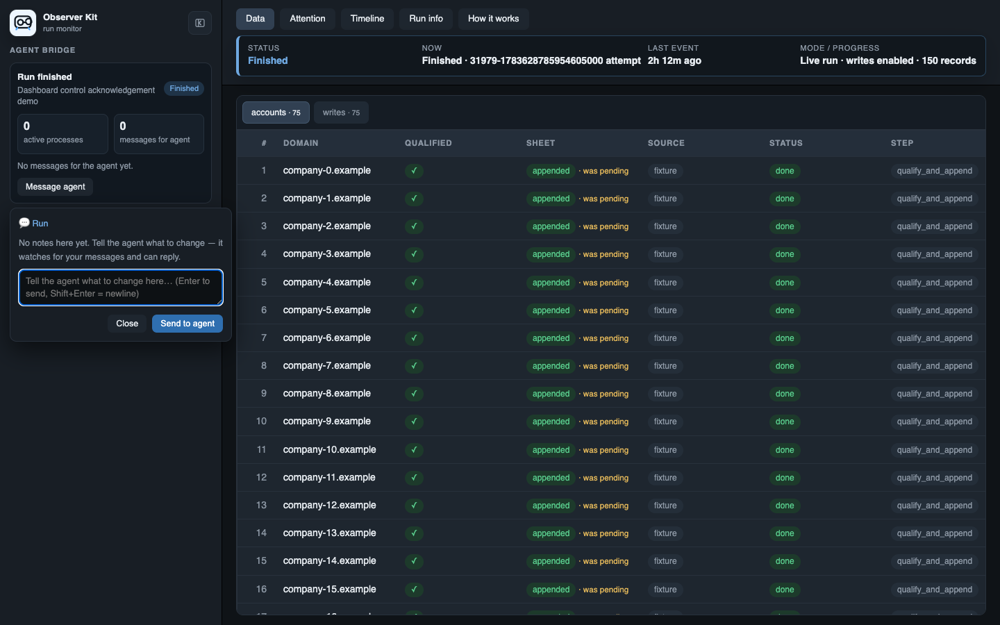

<h1 align="center">Observer</h1>

<p align="center"><strong>Visible execution and orchestration for agent-run data work.</strong></p>

<p align="center"><strong>Observer Kit</strong> supervises each run. <strong>Observer Flow</strong> coordinates dependent steps.</p>

<p align="center">
  
  
  
  
  
</p>

<p align="center">
  
</p>

Data transformation used to happen in familiar places: a database query, a
spreadsheet, a table you could watch change row by row. Now an agent can pull
records, enrich them, and write the results back while you wait in a chat.

That is fast, but it is hard to review. You cannot see what landed, spot a bad
row early, or tell the agent exactly what needs to change while the workflow is
still running.

This repository gives the agent two connected layers. **Observer Kit** turns an
agent-run data transformation into a reviewable working session. **Observer
Flow** lets the agent compose dependent transformations as a visible graph while
Observer Kit continues to supervise the complete run.

The local dashboard lets you see rows arrive, inspect what changed, follow each
row through a multi-step flow, message the agent about a specific record, and
pause the run when something needs attention.

Use it for imports, database exports, enrichment, backfills, CRM updates,
spreadsheet pushes, and any other job that changes or moves many records.

It gives the collaboration loop a few simple pieces:

- **A live table**: see the actual source rows and outcomes as work lands.
- **A live flow**: inspect nodes, dependencies, batches, branches, and the path
  taken by an individual row.
- **A review conversation**: point the agent at a row or message it about the
  whole run.
- **Run controls**: pause at a checkpoint, stop after the current record, and
  approve a full run only after reviewing a sample.
- **An agent playbook and small CLI**: the agent builds the workflow; the CLI
  provides the repeatable local plumbing.

## How It Works

```text
Agent creates or adapts the real workflow
                 |
        +--------+---------+
        |                  |
   one script       dependent steps
        |                  |
        |           Observer Flow graph
        |                  |
        +--------+---------+
                 |
          Observer Kit harness
                 |
                 v
   Live sample, review, controls, and approval
```

The same run can continue after a fix. Existing rows update in place, so you
see what changed instead of losing the earlier attempt.

## Two Layers

This repository includes two complementary agent skills and one shared local
dashboard:

- **[Observer Kit](skills/observer-kit/SKILL.md)** supervises execution with
  live rows, source locks, durable resume, shared throttling, controls, review,
  and explicit full-run approval.
- **[Observer Flow](skills/observer-flow/SKILL.md)** designs multi-stage graphs
  where later transformations depend on earlier results. Nodes may map, batch,
  branch, expand, join, aggregate, or deliver records.

Observer Flow treats a row as the entity the user follows, a field as visible
data, and a node as one coherent operation that may produce several fields or
child rows. One coordinator schedules the nodes and updates the same row as
results land. Observer Kit remains the harness around the complete run.

As the agent proves reusable nodes, subflows, and integrations, Observer Flow
creates a project `flow-cookbook/`. That cookbook reflects the user's real APIs,
fields, limits, and tests. When repeated mechanics share one meaningful contract
and durable boundary, the agent logs each distinct occurrence, shows the user
the evidence, and asks whether to promote them into a reusable code node or
subflow.

An Observer Flow coordinator runs through the same CLI and dashboard:

```bash
observer-kit run --state-dir .runguard -- \
  python3 flow_coordinator.py --flow pipeline.flow.json --dry-run --limit 10
```

The [synthetic Flow demos](examples/observer-flow-demo/README.md) show
conditional routing and a mixed workflow where individual homepage requests
feed a discounted batch-labeling API while results still return to their stable
business rows.

## Dashboard

The dashboard runs only on localhost. It reads the JSONL ledger the workflow
writes while it works.

It assumes a trusted local machine. Do not forward the dashboard port or expose
it on a network.

The **Data** tab shows one row per source item. The columns come from the
workflow itself: a company-sourcing run might show domains, qualification,
LinkedIn, email, and sheet status; another workflow might show entirely
different fields. Use **Filter columns** to combine text, category, and number
filters while you inspect a large run.

<p align="center">
  
</p>

<p align="center"><em>The Data view keeps source rows stable while fields and outcomes change.</em></p>

For an Observer Flow run, the **Flow** tab shows the live dependency graph,
which node is running, row outcomes at each node, and the selected row's path.
Click a node to inspect its script, inputs, outputs, condition, and rows. The
Data table remains the business view and updates the same stable rows as fields
land from successive nodes.

<p align="center">
  
</p>

<p align="center"><em>Select a node to inspect its contract, batch calls, and the rows that reached it.</em></p>

During the first sample, the agent can include a `response_json` cell containing
the decoded response body from the real source call. Click it to inspect the full
JSON, then tell the agent which fields should become normal columns for the run.

The **Timeline** is the plain-English history of the run. **Attention** focuses
on records whose explicit `error` field needs a look. **How it works** shows the
workflow's `EXPLAIN.md` statement of intent.

<p align="center">
  
</p>

<p align="center"><em>Attention stays focused on declared failures instead of guessing from row text.</em></p>

### Talk To The Agent

- **Command-click** a table cell or column header to open a conversation about
  that exact spot. (`Ctrl-click` works on non-macOS systems.)
- Use **Message agent** in the run monitor to discuss the whole run, especially
  after it has paused or finished.
- The agent receives these notes through the run watcher, replies in the same
  thread, and can update the script or resume the run.



### Run Controls

During an active run, the monitor offers:

- **Pause**: requests a pause at the script's next checkpoint.
- **Stop after this record**: lets the current record finish, then pauses.
- **Approve full run**: appears after a dry-run sample and records your approval
  for the agent to start the intentional full-run command.

Clicking Pause or Stop sends the control request immediately and opens the
normal chat so you can explain what the agent should inspect. A green check
means the worker acknowledged the request. The dashboard does not kill a
process; the script pauses at a checkpoint where it has recorded its progress.

## Install

The repository ships two agent skills and one CLI. The Observer Kit skill
contains the execution playbook and standalone Python helpers. The Observer
Flow skill contains the graph-design and coordination playbook. The CLI makes
setup, launch, watching, and checks shorter and repeatable for both. During
agent-led setup, the skills check for the CLI, install it in a writable Python
environment when needed, and verify it before initializing the project. The
bundled helpers remain available for skill-only setups and environments where
package installation is unavailable.

The CLI keeps the established `observer-kit` command so existing projects and
install instructions continue to work.

Use the skills as the source of truth for operator behavior: how the agent
selects a sample, interprets dashboard controls, fixes a run, and asks for
full-run approval. Use the CLI as the repeatable local plumbing for the same
contract. See the [install matrix](docs/install-matrix.md) for the supported
paths and compatibility expectations.

Install the repository's skills for all local projects:

```bash
npx skills add edsmkt/observer-kit -g
```

Or add them only to the current project:

```bash
npx skills add edsmkt/observer-kit
```

Install the CLI directly from GitHub into a writable Python environment:

```bash
python3 -m pip install git+https://github.com/edsmkt/observer-kit.git
observer-kit --help
```

For development, the CLI also runs from this checkout:

```bash
python3 -m pip install -e .
python3 -m observer_kit --help
observer-kit --help
```

## Start A Project

With the CLI, run these commands from the project containing your workflow
script or flow coordinator:

```bash
observer-kit init .
observer-kit dashboard .runguard --port 8484
```

`init` adds the small Python helper, a private `.runguard` state directory, and
an `EXPLAIN.md` template. Keep the dashboard running while the agent works.

With a skill-only installation, ask the agent to use Observer Kit's
bundled-script path. It copies `runguard.py` and `watch_chat.py` beside the
workflow, creates `.runguard`, copies the `EXPLAIN.md` template, and launches
`run_dashboard.py` directly. The resulting locks, ledgers, controls, chat, and
dashboard are the same as the CLI path.

Then ask your agent to wire Observer Kit into the real script. With the CLI, a
typical first run is:

```bash
observer-kit run --state-dir .runguard --dashboard -- \
  python3 enrich_companies.py --dry-run --limit 10
```

After you review the sample and explicitly approve it:

```bash
observer-kit run --state-dir .runguard -- \
  python3 enrich_companies.py --full-run
```

`observer-kit run` attaches to an existing dashboard, starts the command, and
creates or reuses one watcher for that run. Separate run IDs keep independent
watchers. For one long-lived project session, an all-run watcher can cover the
project and subsequent runs reuse it. Check ownership with:

```bash
observer-kit watch .runguard --status
```

The watcher remains transport; your agent makes decisions and requests full-run approval.

The ledger is append-only JSONL by design. For very long backfills, split work
into bounded runs or chunks with stable source identities, persist authoritative
results in a durable store, and keep raw provider responses to samples or debug
cases. The dashboard is for live review and audit, not a replacement for the
workflow's durable destination.

## A Simple Script

For a new Python workflow, the helper keeps the integration small:

```python
from runguard import start_observed_run

run = start_observed_run(
    'enrich-leads',
    source=args.input,
    dry_run=args.dry_run,
    todo=len(leads),
    progress_table='companies',
    summary_metrics=[
        {'key': 'processed', 'label': 'processed'},
        {'key': 'planned', 'label': 'planned'},
        {'key': 'written', 'label': 'written'},
    ],
)

try:
    for lead in leads:
        run.check_controls()
        with run.step('enrich_lead', table='companies', key=lead.id,
                      company=lead.domain):
            result = enrich_lead(lead)
            if not run.dry_run:
                update_crm_lead(lead.id, result)
            run.count('planned' if run.dry_run else 'written')
            run.count('processed')
            run.checkpoint('last_lead', lead.id)
    run.success(processed=len(leads))
except Exception as exc:
    run.fail(exc)
    raise
```

The important part is simple: keep two guarantees separate. Emit each row while
the real work happens so the dashboard stays live, and save the actual result to
a re-readable destination before moving on so a restart can continue from
durable progress.

## For Builders

Observer Kit provides practical run-management pieces when a workflow needs them:

- Source-based run locks and durable checkpoints for restarts.
- Append-only JSONL ledgers for live records, progress, and audit history.
- Shared provider throttling across local processes.
- Input snapshots, sample previews, validation, policy checks, and quality gates.
- Write intents and receipts for CRM, spreadsheet, database, file, webhook, and
  API delivery steps.
- Reconciliation and targeted replay candidates for incomplete work.

Use the workflow's real source identity for `source=`: a resolved file path,
Sheet or export ID, table plus query identity, or similar stable identifier.
That lets Observer Kit identify the same dataset across retries and show its
history in one run lane.

For implementation patterns and event vocabulary, see
[skills/observer-kit/references/pattern.md](skills/observer-kit/references/pattern.md).
The agent skill is at [skills/observer-kit/SKILL.md](skills/observer-kit/SKILL.md).

For dependency-driven workflows, see the
[Observer Flow skill](skills/observer-flow/SKILL.md) and its
[graph contract](skills/observer-flow/references/flow-contract.md).

## CLI Reference

```bash
observer-kit init [project]
observer-kit dashboard [state_dir] --port 8484
observer-kit run --state-dir .runguard -- python3 workflow.py --dry-run --limit 10
observer-kit watch .runguard --run runguard:my-run.jsonl --follow
observer-kit reply .runguard --run runguard:my-run.jsonl --anchor run --text "I fixed this."
observer-kit doctor [project]
observer-kit test
```

Run the full acceptance suite from this repository with:

```bash
python3 -m observer_kit test
```

## License

MIT
