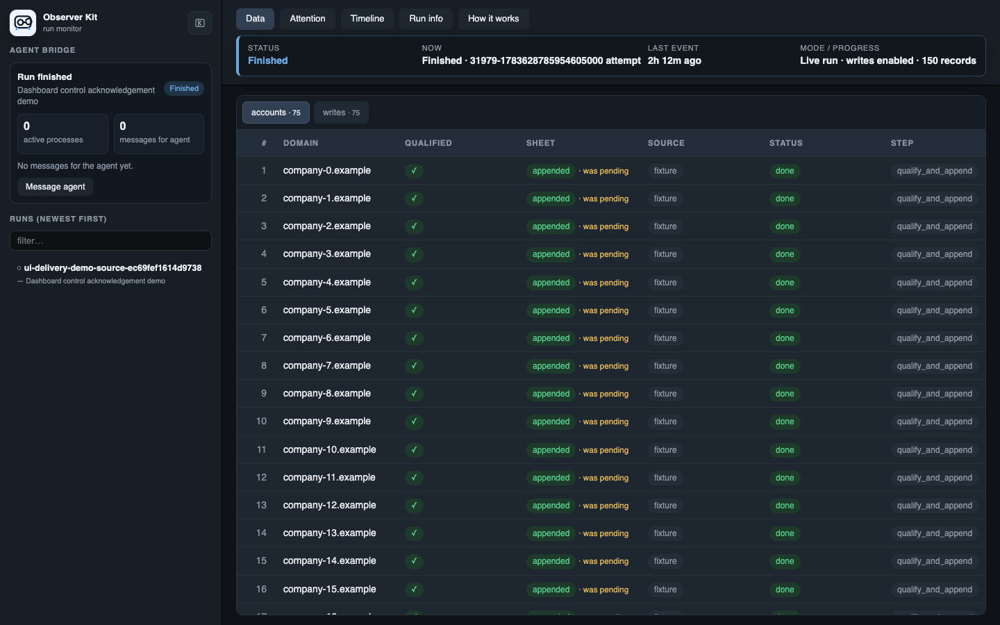

<h1 align="center">observer-kit</h1>

<p align="center"><strong>For when your agent does the data work, but you still need to see it.</strong></p>

<p align="center">A local workflow harness for agent-run data transformation.</p>

<p align="center">
  
  
  
  
  
</p>

<p align="center">
  
</p>

Data transformation used to happen in familiar places: a database query, a
spreadsheet, a table you could watch change row by row. Now an agent can pull
records, enrich them, and write the results back while you wait in a chat.

That is fast, but it is hard to review. You cannot see what landed, spot a bad
row early, or tell the agent exactly what needs to change while the workflow is
still running.

Observer Kit turns an agent-run data transformation into a reviewable working
session. It gives you a live local dashboard where you can see rows arrive,
inspect what changed, message the agent about a specific record, and pause the
run when something needs attention.

Use it for imports, database exports, enrichment, backfills, CRM updates,
spreadsheet pushes, and any other job that changes or moves many records.

It gives the collaboration loop a few simple pieces:

- **A live table**: see the actual source rows and outcomes as work lands.
- **A review conversation**: point the agent at a row or message it about the
  whole run.
- **Run controls**: pause at a checkpoint, stop after the current record, and
  approve a full run only after reviewing a sample.
- **An agent playbook and small CLI**: the agent builds the workflow; the CLI
  provides the repeatable local plumbing.

## How It Works

```text
Agent adapts the real workflow
            |
            v
Small sample runs first and fills the dashboard
            |
            v
You inspect rows, message the agent, or pause the run
            |
            v
The agent fixes, continues, or starts the approved full run
```

The same run can continue after a fix. Existing rows update in place, so you
see what changed instead of losing the earlier attempt.

## Dashboard

The dashboard runs only on localhost. It reads the JSONL ledger the workflow
writes while it works.

The **Data** tab shows one row per source item. The columns come from the
workflow itself: a company-sourcing run might show domains, qualification,
LinkedIn, email, and sheet status; another workflow might show entirely
different fields.


The **Timeline** is the plain-English history of the run. **Attention** focuses
on records that need a look. **How it works** shows the workflow's `EXPLAIN.md`
statement of intent.

### Talk To The Agent

- **Command-click** a table cell or column header to open a conversation about
  that exact spot. (`Ctrl-click` works on non-macOS systems.)
- Use **Message agent** in the run monitor to discuss the whole run, especially
  after it has paused or finished.
- The agent receives these notes through the run watcher, replies in the same
  thread, and can update the script or resume the run.


### Run Controls

During an active run, the monitor offers:

- **Pause**: requests a pause at the script's next checkpoint.
- **Stop after this record**: lets the current record finish, then pauses.
- **Approve full run**: appears after a dry-run sample and records your approval
  for the agent to start the intentional full-run command.

Clicking Pause or Stop sends the control request immediately and opens the
normal chat so you can explain what the agent should inspect. A green check
means the worker acknowledged the request. The dashboard does not kill a
process; the script pauses at a checkpoint where it has recorded its progress.

## Install

Install the skill for all local projects:

```bash
npx skills add edsmkt/observer-kit -g
```

Or add it only to the current project:

```bash
npx skills add edsmkt/observer-kit
```

The Python CLI also runs directly from this checkout:

```bash
python3 -m observer_kit --help
```

For the `observer-kit` command, install into a writable Python environment:

```bash
python3 -m pip install -e .
observer-kit --help
```

## Start A Project

From the project containing your workflow script:

```bash
observer-kit init .
observer-kit dashboard .runguard --port 8484
```

`init` adds the small Python helper, a private `.runguard` state directory, and
an `EXPLAIN.md` template. Keep the dashboard running while the agent works.

Then ask your agent to wire Observer Kit into the real script. A typical first
run is:

```bash
observer-kit run --state-dir .runguard --dashboard -- \
  python3 enrich_companies.py --dry-run --limit 10
```

After you review the sample and explicitly approve it:

```bash
observer-kit run --state-dir .runguard -- \
  python3 enrich_companies.py --full-run
```

`observer-kit run` attaches to an existing dashboard, starts the command, and
connects the run watcher. It does not make decisions or approve a full run for
you.

## A Simple Script

For a new Python workflow, the helper keeps the integration small:

```python
from runguard import start_observed_run

run = start_observed_run(
    'enrich-leads',
    source=args.input,
    dry_run=args.dry_run,
    todo=len(leads),
    progress_table='companies',
)

try:
    for lead in leads:
        run.check_controls()
        with run.step('enrich_lead', table='companies', key=lead.id,
                      company=lead.domain):
            result = enrich_lead(lead)
            if not run.dry_run:
                update_crm_lead(lead.id, result)
            run.count('processed')
            run.checkpoint('last_lead', lead.id)
    run.success(processed=len(leads))
except Exception as exc:
    run.fail(exc)
    raise
```

The important part is simple: emit each row while the real work happens. The
dashboard then stays live, and a restart can continue from durable progress.

## For Builders

Observer Kit provides practical run-management pieces when a workflow needs them:

- Source-based run locks and durable checkpoints for restarts.
- Append-only JSONL ledgers for live records, progress, and audit history.
- Shared provider throttling across local processes.
- Input snapshots, sample previews, validation, policy checks, and quality gates.
- Write intents and receipts for CRM, spreadsheet, database, file, webhook, and
  API delivery steps.
- Reconciliation and targeted replay candidates for incomplete work.

Use the workflow's real source identity for `source=`: a resolved file path,
Sheet or export ID, table plus query identity, or similar stable identifier.
That lets Observer Kit identify the same dataset across retries and show its
history in one run lane.

For implementation patterns and event vocabulary, see
[skills/observer-kit/references/pattern.md](skills/observer-kit/references/pattern.md).
The agent skill is at [skills/observer-kit/SKILL.md](skills/observer-kit/SKILL.md).

## CLI Reference

```bash
observer-kit init [project]
observer-kit dashboard [state_dir] --port 8484
observer-kit run --state-dir .runguard -- python3 workflow.py --dry-run --limit 10
observer-kit watch .runguard --run runguard:my-run.jsonl --follow
observer-kit reply .runguard --run runguard:my-run.jsonl --anchor run --text "I fixed this."
observer-kit doctor [project]
observer-kit test
```

Run the full acceptance suite from this repository with:

```bash
python3 -m observer_kit test
```

## License

MIT
